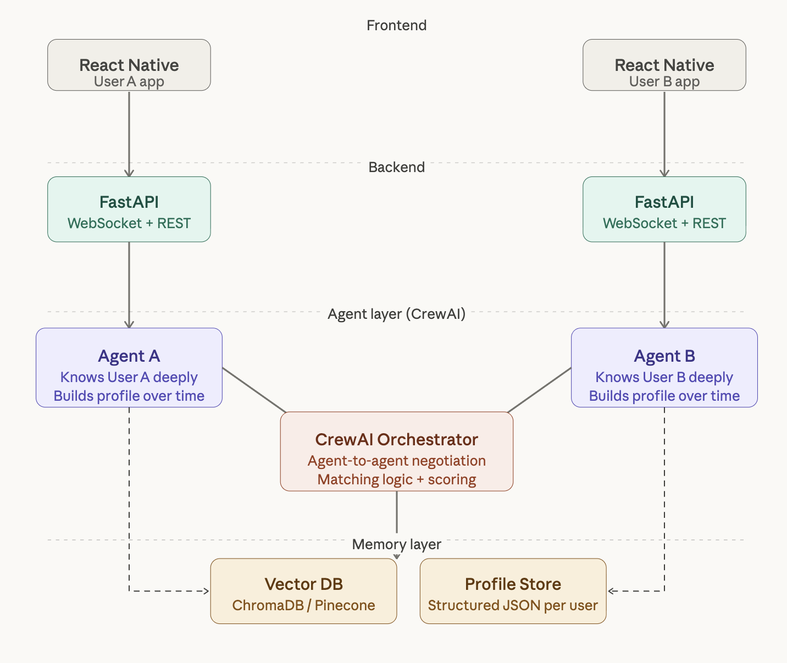

# Agent Tinder Link

A futuristic AI matchmaking platform where personal agents help users discover compatible people.

## System Design



## Tech Stack

- React Native (Expo)
- TypeScript
- Expo Router
- React Native Reanimated
- Python (crewAI)
- uv (Python dependency manager)

## Agent Architecture (Goal-Driven)

The backend is a **goal-based, tool-using multi-agent system** (powered by crewAI). Each agent has an explicit role + goal, and the system routes work through focused flows:

- **Personality Agent**: chats with a user, extracts signals, and builds an evolving personality profile.
- **Matching Agent**: compares one target profile against all saved profiles and produces a ranked shortlist.
- **Conversation + Evaluation Agents**: simulates an agent-to-agent conversation for a candidate pair and produces a connection verdict.

Agent behavior is configured in:

- `backend/agent_backend/src/agent_backend/config/agents.yaml`
- `backend/agent_backend/src/agent_backend/config/tasks.yaml`

## Knowledge Base

Shared domain context can live in `backend/agent_backend/knowledge/` (e.g. `information.md`). Populate it with grounding notes you want agents to follow.

## Quickstart

### Backend (agents)

```bash
cd backend/agent_backend

# Put your model provider key(s) in backend/agent_backend/.env
# Optionally set MODEL=gemini/gemini-2.5-flash (or another crewAI-supported model)

pip install uv
uv sync

# Personality chat (default flow)
uv run agent_backend

# Matching for a username you already onboarded
uv run match <username>

# Conversation simulation (uses latest matches by default)
uv run convo <username>
```

### Frontend (Expo)

```bash
cd frontend/agent-tinder-finder
yarn install
yarn start
```
